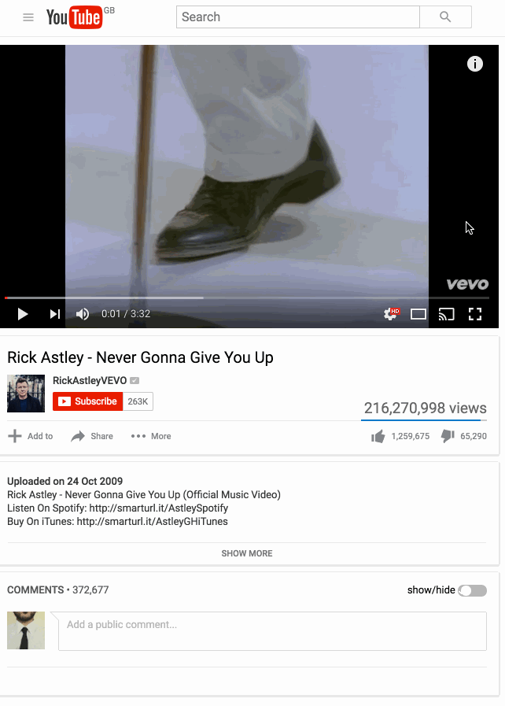

# YouTube Only Subscribed Comments

** This extension is not in the extension store, you have to clone the repo to install it. **

Hides YouTube comments for channels you are not subscribed to and adds a toggle to show/hide them at will.

Because [@somoso](https://github.com/somoso) requested it 😀.

Uses `MutationObserver` to listen to the addition of `.comment-section-renderer-items` to `#watch-discussion`
because the comments section is only added to the DOM when it comes into the viewport.

## Usage
- Clone this repo
- Run `npm install` to install dependencies
- Run `gulp build`
- Load an unpacked extension from the `dist` directory

## Development
- Clone this repo
- Run `npm install` to install dependencies
- Load an unpacked extension from the `app` directory
- Run `grunt watch`

## Demo

## Notes
Created using the [yeoman Chrome extension generator](https://github.com/yeoman/generator-chrome-extension).
